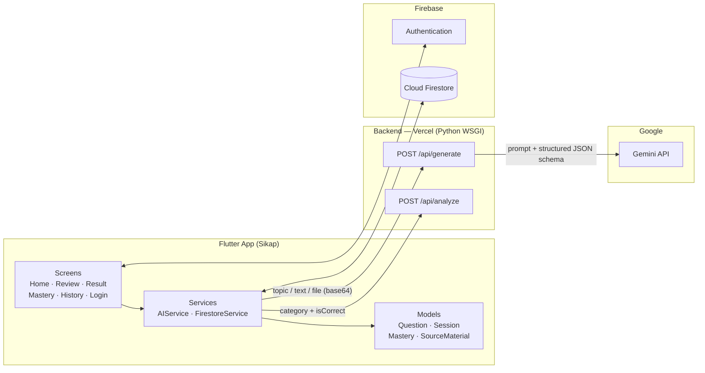

# Sikap — Adaptive AI Quiz & Flashcard Learning

> Not just an AI quiz generator — Sikap finds what you struggle with and builds your next study session around it.

Sikap turns a **topic, a pasted text, or an uploaded file** (PDF / photo) into a multiple-choice quiz using Gemini, tracks your **mastery per category**, detects weak areas, and generates a **targeted remedial quiz** with one tap.

```
Quiz → Detect weaknesses → Generate targeted questions → Retest
```

## Features

- **Three ways to generate a quiz** — topic only, pasted text, or file upload (PDF, TXT, MD, HTML, PNG, JPEG, WEBP; max 3 MB).
- **Source-grounded questions** — when a file or text is supplied, each question carries a verbatim excerpt (with page/line where available) so answers can be verified.
- **Explain-why on mistakes** — a wrong answer reveals the explanation and source inline before continuing.
- **Per-category mastery** — every question has a subtopic category; results are grouped and scored (weak = below 70%).
- **Fix My Weaknesses** — one tap builds a remedial quiz (3 questions per weak category, worst-first).
- **Mastery Overview** — aggregated, worst-first mastery across all sessions, with tap-to-practice on weak categories.
- **Session history** — browse past sessions and every question/answer.
- **Offline demo insurance** — pre-cached fallback quizzes if the backend or network fails.
- **Accounts** — Firebase email/password auth; guests can still take quizzes (progress is saved only when logged in).

## Architecture at a glance



See [`docs/ARCHITECTURE.md`](docs/ARCHITECTURE.md) for the full breakdown and [`docs/DOCUMENTATION.md`](docs/DOCUMENTATION.md) for API, data model, and flows.

## Tech stack

| Layer | Technology |
|---|---|
| Mobile / web client | Flutter (Material 3), `file_picker`, `http` |
| Auth | Firebase Authentication (email + password) |
| Database | Cloud Firestore |
| Backend | Python WSGI app on Vercel |
| AI | Google Gemini via `google-genai` (structured JSON output) |

## Repository layout

```
backend/
└── app.py                       # /api/generate and /api/analyze

lib/
├── main.dart                    # Firebase init, MaterialApp → HomeScreen
├── models/
│   ├── question.dart            # Question, category normalization, Attempt builder
│   ├── session.dart             # Session (id, timestamp, score, total)
│   ├── mastery.dart             # CategoryMastery, AnalysisResult (+ aggregate)
│   ├── source_material.dart     # Uploaded file + validation
│   └── user.dart
├── services/
│   ├── ai_service.dart          # Backend calls, fallback, remedial quiz fan-out
│   └── firestore_service.dart   # Save sessions + attempts
├── data/fallback_quizzes.dart   # Offline quizzes
├── screens/
│   ├── home_screen.dart         # Input (file / text / topic), drawer
│   ├── review_screen.dart       # Quiz flow + inline explanation
│   ├── result_screen.dart       # Score, mastery, Fix My Weaknesses, saves session
│   ├── mastery_overview_screen.dart  # Aggregate mastery + tap-to-practice
│   ├── teacher_overview_screen.dart  # Alias of MasteryOverviewScreen
│   ├── history_screen.dart
│   ├── session_detail_screen.dart
│   └── login_screen.dart
├── theme/app_theme.dart
└── widgets/sikap_chrome.dart    # AppBar, gradient background, focus card, drawer
```

> Files `app_theme.dart`, `sikap_chrome.dart` and `fallback_quizzes.dart` are referenced by the code; adjust paths above if your tree differs.

## Getting started

### Prerequisites

- Flutter SDK (stable) and a configured device/emulator
- A Firebase project with **Authentication (Email/Password)** and **Firestore** enabled
- A Google AI Studio API key for Gemini
- A Vercel account (for the backend)

### 1. Backend

```bash
pip install google-genai
export GEMINI_API_KEY="your-key"
# Optional: comma-separated models, tried in order until one succeeds
export GEMINI_MODELS="model-a,model-b"
```

Deploy to Vercel and set `GEMINI_API_KEY` (and optionally `GEMINI_MODELS`) as environment variables in the project settings. `app.py` exposes a standard WSGI callable named `app`.

Then point the Flutter client at your deployment by editing the two URLs in `lib/services/ai_service.dart`:

```dart
static final Uri _analyzeUrl  = Uri.parse('https://<your-app>.vercel.app/api/analyze');
static final Uri _generateUrl = Uri.parse('https://<your-app>.vercel.app/api/generate');
```

### 2. Flutter app

```bash
flutter pub get
flutterfire configure     # generates firebase_options / platform config
flutter run
```

Required packages include: `firebase_core`, `firebase_auth`, `cloud_firestore`, `http`, `file_picker`.

### 3. Fonts

The loading screen uses the `PixelifySans` font — declare it in `pubspec.yaml` if you use that screen.

## API summary

| Endpoint | Purpose | Key request fields |
|---|---|---|
| `POST /api/generate` | Generate 1–20 MCQs | `topic`, `difficulty` (easy/medium/hard), `count`, optional `fileData`+`mimeType` or `sourceText` |
| `POST /api/analyze` | Per-category stats and weaknesses | `questions: [{category, isCorrect}]` (1–50) |

Full contracts in [`docs/DOCUMENTATION.md`](docs/DOCUMENTATION.md#4-backend-api-reference).

## Roadmap ideas

- Study streak and AI-written study report after each session
- Firestore Security Rules hardening and email verification (currently commented out)
- Spaced repetition on weak categories
- Teacher/class roles (the `TeacherOverviewScreen` alias is already in place)

## License

Add your license here.
